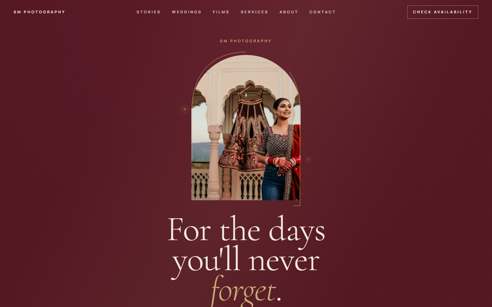
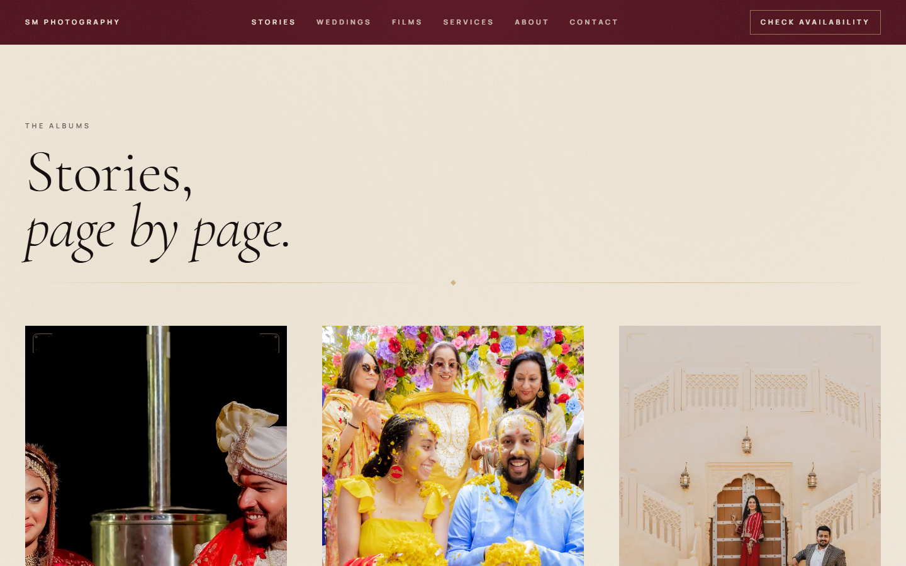
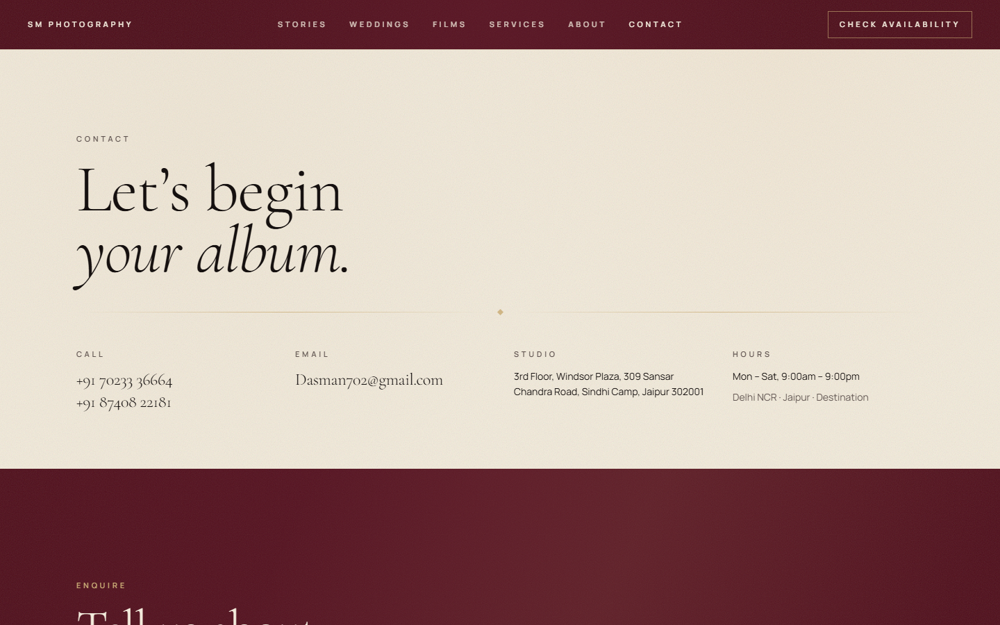

# SM Photography

Wedding photography and cinematography studio site for SM Photography — Jaipur, Delhi NCR, and destination weddings.

Live: [indian-album-unfolding.vercel.app](https://indian-album-unfolding.vercel.app)

The site is built as a digital wedding album: invitation hero, ritual chapters, stories, films, and a WhatsApp / email enquiry path. Copy and contact details come from [smphotography.in](https://smphotography.in). Photographs are the studio’s published work.



## Features

- Invitation-style hero with arch reveal and scroll unfold
- Chaptered wedding day: Before, Mehndi, Haldi, Sangeet, Baraat, Ceremony, Reception
- Album story pages with sequenced photography
- Published Vimeo teasers (no autoplay audio)
- Editorial services list and enquiry form (WhatsApp + email)
- Real studio contact details, hours, and Jaipur address
- LocalBusiness / Photographer JSON-LD, sitemap, reduced-motion support, keyboard-visible focus





## Stack

- [TanStack Start](https://tanstack.com/start) (SSR, file routes)
- React 19 + TypeScript
- Vite 8 + Nitro (Vercel preset)
- Tailwind CSS 4
- TanStack Router / Query

## Architecture

SSR React app. `src/routes` is the page tree. `src/components/site` renders the album UI. `src/lib/site.ts` holds verified business data; `src/lib/photos.ts` maps local WebP files in `public/photos`. Enquiry does not hit a backend — it opens WhatsApp or a mailto with the form text. Nitro builds a Vercel serverless handler plus static assets.

## Routes

| Path | Page |
| --- | --- |
| `/` | Home — invitation through enquiry |
| `/stories` | Album index |
| `/stories/$slug` | Individual album |
| `/contact` | Contact + enquiry |

Story slugs: `the-wedding-day`, `the-functions`, `before-the-wedding`.

## Setup

Requires Node.js 22+.

```sh
git clone https://github.com/Amaar-Ali/SM-Photography.git
cd SM-Photography
npm install
npm run dev
```

Dev server: Vite (`vite dev`).

## Environment variables

None. No `.env` file is required for local or production.

## Scripts

| Command | Purpose |
| --- | --- |
| `npm run dev` | Local development |
| `npm run build` | Production build (Nitro → `.vercel/output`) |
| `npm run preview` | Preview the production build |
| `npm run lint` | ESLint |
| `npm run typecheck` | `tsc --noEmit` |
| `npm run format` | Prettier |

## Project structure

```
public/photos/          Optimised WebP photography
src/routes/             File-based pages (__root, index, contact, stories)
src/components/site/    Page sections (Hero, Chapters, Nav, Enquiry, …)
src/lib/site.ts         Verified business details, films, reviews
src/lib/photos.ts       Image paths and alt text
src/lib/stories.ts      Album collections
src/styles.css          Colour, type, and motion tokens
```

## Deploy

Vercel, TanStack Start preset. Build command is `vite build`. Nitro emits `.vercel/output`.

```sh
npx vercel --prod
```

Production URL: https://indian-album-unfolding.vercel.app

No secrets to configure. Enquiry goes to WhatsApp (`+91 70233 36664`) and `Dasman702@gmail.com`.

## Credits

Photography, films, and client quotes belong to SM Photography. Studio: Windsor Plaza, Sindhi Camp, Jaipur.
